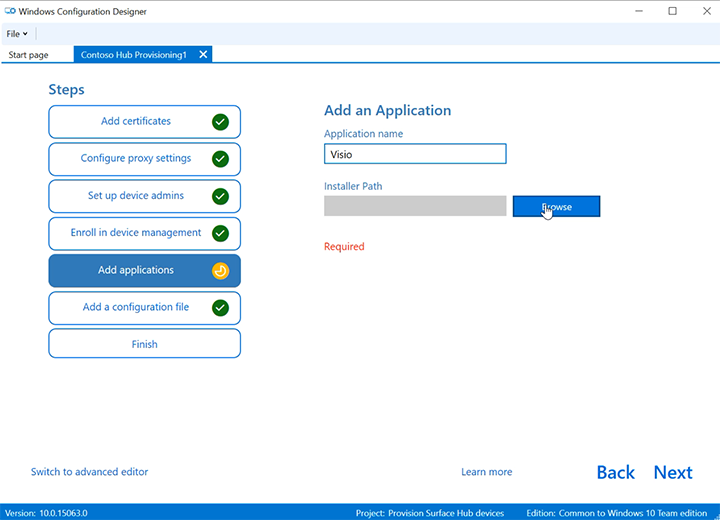

# <a name="create-provisioning-packages-for-surface-hub"></a><span data-ttu-id="fda05-104">ユーザーのプロビジョニング パッケージを作成Surface Hub</span><span class="sxs-lookup"><span data-stu-id="fda05-104">Create provisioning packages for Surface Hub</span></span>

<span data-ttu-id="fda05-105">プロビジョニング パッケージを使用すると、主要な機能の展開を自動化し、組織内のすべての Surface Hub で一貫性のあるエクスペリエンスを提供できます。</span><span class="sxs-lookup"><span data-stu-id="fda05-105">Provisioning packages allow you to automate deployment of key features, helping deliver a consistent experience across all Surface Hubs in your organization.</span></span>  <span data-ttu-id="fda05-106">別Windows PC で構成デザイナー (WCD) を使用すると、次のタスクを実行できます。</span><span class="sxs-lookup"><span data-stu-id="fda05-106">Using  Windows Configuration Designer (WCD) on a separate PC, you can complete the following tasks:</span></span>

- <span data-ttu-id="fda05-107">Active Directory または Active Directory に登録Azure Active Directory</span><span class="sxs-lookup"><span data-stu-id="fda05-107">Enroll in Active Directory or Azure Active Directory</span></span>
- <span data-ttu-id="fda05-108">デバイス管理者アカウントの作成</span><span class="sxs-lookup"><span data-stu-id="fda05-108">Create a device administrator account</span></span>
- <span data-ttu-id="fda05-109">アプリケーションと証明書の追加</span><span class="sxs-lookup"><span data-stu-id="fda05-109">Add applications and certificates</span></span>
- <span data-ttu-id="fda05-110">プロキシ設定の構成</span><span class="sxs-lookup"><span data-stu-id="fda05-110">Configure proxy settings</span></span>
- <span data-ttu-id="fda05-111">Surface Hub の構成ファイルの追加</span><span class="sxs-lookup"><span data-stu-id="fda05-111">Add a Surface Hub configuration file</span></span>
- <span data-ttu-id="fda05-112">構成 [サービス プロバイダー (CSP) の設定を構成する](/windows/client-management/mdm/surfacehub-csp)</span><span class="sxs-lookup"><span data-stu-id="fda05-112">Configure [Configuration Service Provider (CSP) settings](/windows/client-management/mdm/surfacehub-csp)</span></span>

## <a name="overview"></a><span data-ttu-id="fda05-113">概要</span><span class="sxs-lookup"><span data-stu-id="fda05-113">Overview</span></span>

1. <span data-ttu-id="fda05-114">サーバーを実行している別Windows 10、Windows[構成デザイナー](https://www.microsoft.com/store/apps/9nblggh4tx22)をインストールMicrosoft Store。</span><span class="sxs-lookup"><span data-stu-id="fda05-114">On a separate PC running Windows 10, install [Windows Configuration Designer](https://www.microsoft.com/store/apps/9nblggh4tx22) from the Microsoft Store.</span></span>
1. <span data-ttu-id="fda05-115">[[**デバイスのプロビジョニングSurface Hubウィザード**](#use-surface-hub-provisioning-wizard)を使用して共通の設定を構成する] を選択します。</span><span class="sxs-lookup"><span data-stu-id="fda05-115">Select [**Provision Surface Hub devices**](#use-surface-hub-provisioning-wizard) to configure common settings using a wizard.</span></span> <span data-ttu-id="fda05-116">または、[ [高度なプロビジョニング] を選択](#use-advanced-provisioning) して、可能なすべての設定を表示および構成します。</span><span class="sxs-lookup"><span data-stu-id="fda05-116">Or select [Advanced provisioning](#use-advanced-provisioning) to view and configure all possible settings.</span></span>
1. <span data-ttu-id="fda05-117">プロビジョニング パッケージを作成し、USB ドライブに保存します。</span><span class="sxs-lookup"><span data-stu-id="fda05-117">Create the provisioning package and save it to a USB drive.</span></span>
1. <span data-ttu-id="fda05-118">最初に実行するセットアップ中Surface Hub、またはアプリを使用して、パッケージを設定します。</span><span class="sxs-lookup"><span data-stu-id="fda05-118">Deploy the package to your Surface Hub during first-run setup, or through the Settings app.</span></span> <span data-ttu-id="fda05-119">詳細については、「Create [a provisioning package for a provisioning package for Windows 10」 を参照してください](/windows/configuration/provisioning-packages/provisioning-create-package)。</span><span class="sxs-lookup"><span data-stu-id="fda05-119">To learn more, see [Create a provisioning package for Windows 10](/windows/configuration/provisioning-packages/provisioning-create-package).</span></span>

## <a name="use-surface-hub-provisioning-wizard"></a><span data-ttu-id="fda05-120">プロビジョニング ウィザードSurface Hub使用する</span><span class="sxs-lookup"><span data-stu-id="fda05-120">Use Surface Hub provisioning wizard</span></span>

1. <span data-ttu-id="fda05-121">[構成Windowsを開き、[デバイスのプロビジョニング **] をSurface Hubします**。</span><span class="sxs-lookup"><span data-stu-id="fda05-121">Open Windows Configuration Designer and select **Provision Surface Hub devices**.</span></span><br>
    
    
2. <span data-ttu-id="fda05-123">プロジェクトに名前を付け、[次へ] を **選択します**。</span><span class="sxs-lookup"><span data-stu-id="fda05-123">Name your project and select **Next**.</span></span>

### <a name="add-certificates"></a><span data-ttu-id="fda05-124">証明書を追加する</span><span class="sxs-lookup"><span data-stu-id="fda05-124">Add certificates</span></span>

> [!div class="mx-imgBorder"]
> 

<span data-ttu-id="fda05-126">デバイスを証明書でプロビジョニングするには、[証明書の追加 **] を選択します**。</span><span class="sxs-lookup"><span data-stu-id="fda05-126">To provision the device with a certificate, select **Add a certificate**.</span></span> <span data-ttu-id="fda05-127">証明書の名前を入力し、参照して使用する証明書を選択します。</span><span class="sxs-lookup"><span data-stu-id="fda05-127">Enter a name for the certificate, and then browse to select the certificate to be used.</span></span>  <span data-ttu-id="fda05-128">高度なプロビジョニング オプションについては、「パッケージに証明書を追加 [する」のセクションを参照してください](#add-a-certificate-to-your-package)。</span><span class="sxs-lookup"><span data-stu-id="fda05-128">For advanced provisioning options, refer to the section below [Add a certificate to your package](#add-a-certificate-to-your-package).</span></span>

### <a name="configure-proxy-settings"></a><span data-ttu-id="fda05-129">プロキシ設定の構成</span><span class="sxs-lookup"><span data-stu-id="fda05-129">Configure proxy settings</span></span>

> [!div class="mx-imgBorder"]
> 

1. <span data-ttu-id="fda05-131">プロキシ設定を **[はい]** または **[いいえ]** に切り替えます。</span><span class="sxs-lookup"><span data-stu-id="fda05-131">Toggle **Yes** or **No** for proxy settings.</span></span> <span data-ttu-id="fda05-132">既定では、Surface Hubプロキシ設定が自動的に検出されます。</span><span class="sxs-lookup"><span data-stu-id="fda05-132">By default, Surface Hub automatically detects proxy settings.</span></span> <span data-ttu-id="fda05-133">ただし、それまでのプロキシ サーバーの使用を必要とするインフラストラクチャから、プロキシ サーバーを必要としないインフラストラクチャに変更した場合は、**[はい]** と **[設定を自動的に検出]** を選択することで、プロビジョニング パッケージを使って Surface Hub デバイスを既定の設定に戻すことができます。</span><span class="sxs-lookup"><span data-stu-id="fda05-133">However, if your infrastructure previously required using a proxy server and has changed to not require a proxy server, you can use a provisioning package to revert your Surface Hub devices to the default settings by selecting **Yes** and **Automatically detect settings**.</span></span>
2. <span data-ttu-id="fda05-134">[はい] **を切り**替える場合は、プロキシ設定を自動的に検出するか、次のいずれかを入力して手動で設定を構成できます。</span><span class="sxs-lookup"><span data-stu-id="fda05-134">If you toggle **Yes**, you can select to automatically detect proxy settings or manually configure the settings by entering one of the following:</span></span>

    - <span data-ttu-id="fda05-135">セットアップ スクリプトの URL。</span><span class="sxs-lookup"><span data-stu-id="fda05-135">A URL to a setup script.</span></span>
    - <span data-ttu-id="fda05-136">静的プロキシ サーバーのアドレスとポート情報。</span><span class="sxs-lookup"><span data-stu-id="fda05-136">A static proxy server address and port information.</span></span>

3. <span data-ttu-id="fda05-137">セットアップ スクリプトまたはプロキシ サーバーを使用する場合は、[設定を自動的に検出 **する] をオフにします**。</span><span class="sxs-lookup"><span data-stu-id="fda05-137">If you intend to use a setup script or proxy server, turn off **Automatically detect settings**.</span></span> <span data-ttu-id="fda05-138">セットアップ スクリプトまたはプロキシ サーバー *を* 使用できます。両方を使用することはできません。</span><span class="sxs-lookup"><span data-stu-id="fda05-138">You can use a setup script *or* a proxy server, not both.</span></span>
4. <span data-ttu-id="fda05-139">例外 (プロキシ サーバーをSurface Hub直接接続する必要があるアドレス) を入力します。</span><span class="sxs-lookup"><span data-stu-id="fda05-139">Enter exceptions (addresses that Surface Hub should connect to directly without using the proxy server).</span></span> <span data-ttu-id="fda05-140">**例:** \*.office365.com</span><span class="sxs-lookup"><span data-stu-id="fda05-140">**Example:** \*.office365.com</span></span>
5. <span data-ttu-id="fda05-141">プロキシ サーバーをローカル アドレスに使用するかどうかを指定します。</span><span class="sxs-lookup"><span data-stu-id="fda05-141">Identify whether to use the proxy server for local addresses.</span></span>

### <a name="set-up-device-admins"></a><span data-ttu-id="fda05-142">デバイス管理者の設定</span><span class="sxs-lookup"><span data-stu-id="fda05-142">Set up device admins</span></span>

 > [!div class="mx-imgBorder"]
 > 

<span data-ttu-id="fda05-144">デバイスを Active Directory に登録し、設定アプリを使用するセキュリティ グループを指定するか、Azure Active Directory に登録してグローバル管理者が設定アプリを使用できる環境にするか、デバイス上にローカル管理者アカウントを作成することができます。</span><span class="sxs-lookup"><span data-stu-id="fda05-144">You can enroll the device in Active Directory and specify a security group to use the Settings app, enroll in Azure Active Directory to allow global admins to use the Settings app, or create a local administrator account on the device.</span></span>

1. <span data-ttu-id="fda05-145">デバイスを Active Directory に登録するには、最小限の特権を持つユーザー アカウントの資格情報を入力して、デバイスをドメインに参加させ、Surface Hub で管理者資格情報を持つセキュリティ グループを指定します。</span><span class="sxs-lookup"><span data-stu-id="fda05-145">To enroll the device in Active Directory, enter the credentials for a least-privileged user account to join the device to the domain, and specify the security group to have admin credentials on Surface Hub.</span></span> <span data-ttu-id="fda05-146">パッケージをリセットされた Surface Hubに適用する場合は、最初に設定したアカウントと同じアカウントである限り、同じSurface Hubできます。</span><span class="sxs-lookup"><span data-stu-id="fda05-146">If applying the package to a Surface Hub that was reset, you can use the same domain account as long as it's the same account that set up the Surface Hub initially.</span></span> <span data-ttu-id="fda05-147">そうでない場合は、別のドメイン アカウントをプロビジョニング パッケージで使う必要があります。</span><span class="sxs-lookup"><span data-stu-id="fda05-147">Otherwise, a different domain account must be used in the provisioning package.</span></span>
2. <span data-ttu-id="fda05-148">Azure の一括登録Windows構成する前に[、Azure](/azure/active-directory/devices/azureadjoin-plan)AD参加実装を計画ADしてください。</span><span class="sxs-lookup"><span data-stu-id="fda05-148">Before you use Windows Configuration Designer to configure bulk Azure AD enrollment, [Plan your Azure AD join implementation](/azure/active-directory/devices/azureadjoin-plan).</span></span> <span data-ttu-id="fda05-149">Azure AD テナントの **[ユーザーあたりのデバイスの最大数]** の設定は、ウィザードで利用できる一括トークンを使用できる回数を決定します。</span><span class="sxs-lookup"><span data-stu-id="fda05-149">The **maximum number of devices per user** setting in your Azure AD tenant determines how many times the bulk token that you get in the wizard can be used.</span></span>
3. <span data-ttu-id="fda05-150">Azure AD にデバイスを登録するには、そのオプションを選択して、ウィザードを使って取得する一括トークンのフレンドリ名を入力します。</span><span class="sxs-lookup"><span data-stu-id="fda05-150">To enroll the device in Azure AD, select that option and enter a friendly name for the bulk token you will get using the wizard.</span></span> <span data-ttu-id="fda05-151">トークンの有効期限を設定します (最大、トークンの取得日から 30 日間)。</span><span class="sxs-lookup"><span data-stu-id="fda05-151">Set an expiration date for the token (maximum is 30 days from the date you get the token).</span></span> <span data-ttu-id="fda05-152">[一 **括トークンの取得] を選択します**。</span><span class="sxs-lookup"><span data-stu-id="fda05-152">Select **Get bulk token**.</span></span> <span data-ttu-id="fda05-153">**[サインインしましょう]** ウィンドウで、デバイスを Azure AD に参加させるアクセス許可を持つアカウントを入力し、次にパスワードを入力します。</span><span class="sxs-lookup"><span data-stu-id="fda05-153">In the **Let's get you signed in** window, enter an account that has permissions to join a device to Azure AD, and then the password.</span></span> <span data-ttu-id="fda05-154">[**同意する]** を選択Windows構成デザイナーに必要なアクセス許可を付与します。</span><span class="sxs-lookup"><span data-stu-id="fda05-154">Select **Accept** to give Windows Configuration Designer the necessary permissions.</span></span>
4. <span data-ttu-id="fda05-155">ローカル管理者アカウントを作成するには、そのオプションを選択して、ユーザー名とパスワードを入力します。</span><span class="sxs-lookup"><span data-stu-id="fda05-155">To create a local administrator account, select that option and enter a user name and password.</span></span>

> [!IMPORTANT]
> <span data-ttu-id="fda05-156">プロビジョニング パッケージにローカル アカウントを作成する場合、42 日ごとに**設定**アプリを使ってパスワードを変更する必要があります。</span><span class="sxs-lookup"><span data-stu-id="fda05-156">If you create a local account in the provisioning package, you must change the password using the **Settings** app every 42 days.</span></span> <span data-ttu-id="fda05-157">その期間内にパスワードを変更しない場合、アカウントがロックされてサインインできなくなる可能性があります。</span><span class="sxs-lookup"><span data-stu-id="fda05-157">If the password is not changed during that period, the account might be locked out and unable to sign in.</span></span>

### <a name="enroll-in-third-party-mdm-provider"></a><span data-ttu-id="fda05-158">サード パーティの MDM プロバイダーに登録する</span><span class="sxs-lookup"><span data-stu-id="fda05-158">Enroll in third party MDM provider</span></span>

> [!div class="mx-imgBorder"]
> 

<span data-ttu-id="fda05-160">サード パーティのモバイル デバイス管理 (MDM) プロバイダーを使用する場合は、このセクションを使用してデバイスを登録Surface Hub。</span><span class="sxs-lookup"><span data-stu-id="fda05-160">If you use a third party mobile device management (MDM) provider, you can use this section to enroll Surface Hub.</span></span> <span data-ttu-id="fda05-161">Intune に登録するには、前のセクションで説明したように、最初に Azure AD 参加をセットアップし、次の Intune ドキュメントの手順に従います。Windows 10 デバイスの自動登録[を設定](/mem/intune/enrollment/quickstart-setup-auto-enrollment)します。</span><span class="sxs-lookup"><span data-stu-id="fda05-161">To enroll in Intune, first setup Azure AD join, as described in the previous section, and follow the instructions in the following Intune documentation: [Set up automatic enrollment for Windows 10 devices](/mem/intune/enrollment/quickstart-setup-auto-enrollment).</span></span>

1. <span data-ttu-id="fda05-162">サード パーティ **製 MDM** への登録の場合は、[はい] または [ **いいえ** ] を切り替えます。</span><span class="sxs-lookup"><span data-stu-id="fda05-162">Toggle **Yes** or **No** for enrollment in third party MDM.</span></span>
2. <span data-ttu-id="fda05-163">[はい] **を切**り替える場合は、デバイスの登録を承認されているサービス アカウントとパスワードまたは証明書の拇印を指定し、認証の種類を指定します。</span><span class="sxs-lookup"><span data-stu-id="fda05-163">If you toggle **Yes**, provide a service account and password or certificate thumbprint that is authorized to enroll the device and specify the authentication type.</span></span>
3. <span data-ttu-id="fda05-164">MDM プロバイダーが必要な場合は、探索サービス、登録サービス、およびポリシー サービスの URL を入力します。</span><span class="sxs-lookup"><span data-stu-id="fda05-164">If required by your MDM provider, enter the URLs for the discovery service, enrollment service, and policy service.</span></span>

 <span data-ttu-id="fda05-165">詳細については、「MDM プロバイダーを[使用Surface Hub管理する」を参照してください。](manage-settings-with-mdm-for-surface-hub.md)</span><span class="sxs-lookup"><span data-stu-id="fda05-165">To learn more, see [Manage Surface Hub with an MDM provider.](manage-settings-with-mdm-for-surface-hub.md)</span></span>

### <a name="add-applications"></a><span data-ttu-id="fda05-166">アプリケーションの追加</span><span class="sxs-lookup"><span data-stu-id="fda05-166">Add applications</span></span>

> [!div class="mx-imgBorder"]
> 

<span data-ttu-id="fda05-168">プロビジョニング パッケージには、複数のユニバーサル Windows プラットフォーム (UWP) アプリをインストールできます。</span><span class="sxs-lookup"><span data-stu-id="fda05-168">You can install multiple Universal Windows Platform (UWP) apps in a provisioning package.</span></span> <span data-ttu-id="fda05-169">詳細については、「アプリを使用して [PC をプロビジョニングする」を参照してください](/windows/configuration/provisioning-packages/provision-pcs-with-apps)。</span><span class="sxs-lookup"><span data-stu-id="fda05-169">To learn more, see [Provision PCs with apps](/windows/configuration/provisioning-packages/provision-pcs-with-apps).</span></span>

> [!NOTE]
> <span data-ttu-id="fda05-170">このWindows構成デザイナーでは、クラシック Win32 アプリをプロビジョニング パッケージに追加することができますが、Surface Hub UWP アプリのみを受け入れる必要があります。</span><span class="sxs-lookup"><span data-stu-id="fda05-170">Although Windows Configuration Designer lets you add a Classic Win32 app to a provisioning package, Surface Hub only accepts UWP apps.</span></span> <span data-ttu-id="fda05-171">従来の Win32 アプリを含めると、プロビジョニングが失敗します。</span><span class="sxs-lookup"><span data-stu-id="fda05-171">If you include a Classic Win32 app, provisioning will fail.</span></span>

### <a name="add-a-configuration-file"></a><span data-ttu-id="fda05-172">構成ファイルの追加</span><span class="sxs-lookup"><span data-stu-id="fda05-172">Add a configuration file</span></span>

<span data-ttu-id="fda05-173">このプロビジョニング パッケージに加えて、Surface Hub構成ファイルを使用して、デバイスのセットアップをより簡単に行えます。</span><span class="sxs-lookup"><span data-stu-id="fda05-173">In addition to this provisioning package, you can use a Surface Hub configuration file to make it even easier to set up your devices.</span></span> <span data-ttu-id="fda05-174">Surface Hub構成ファイルには、Exchange、Microsoft Teams、または Skype for Business に接続するためのデバイス アカウントの一覧と、ワイヤレスプロジェクション用の "分名" が含まれる。</span><span class="sxs-lookup"><span data-stu-id="fda05-174">A Surface Hub configuration file contains a list of device accounts for connecting to Exchange, Microsoft Teams, or Skype for Business, as well as "friendly names" for wireless projection.</span></span>

**<span data-ttu-id="fda05-175">構成ファイルをSurface Hubするには、次のSurface Hub使用します。</span><span class="sxs-lookup"><span data-stu-id="fda05-175">To create a Surface Hub configuration file:</span></span>**

1. <span data-ttu-id="fda05-176">[Microsoft Excel (または他の.csv エディター) を開き、.csvという名前SurfaceHubConfiguration.csv</span><span class="sxs-lookup"><span data-stu-id="fda05-176">Open Microsoft Excel (or other .csv editor), create a .csv file named SurfaceHubConfiguration.csv</span></span>
2. <span data-ttu-id="fda05-177">次の形式で、デバイス アカウントとユーザー名の一覧を入力します。</span><span class="sxs-lookup"><span data-stu-id="fda05-177">Enter a list of device accounts and friendly names in this format:</span></span>

    ```
    <DeviceAccountName>,<DeviceAccountPassword>,<FriendlyName>
    ```

    > [!NOTE]
    > <span data-ttu-id="fda05-178">構成ファイルには、列ヘッダーを含めないでください。</span><span class="sxs-lookup"><span data-stu-id="fda05-178">The configuration file must not contain column headers.</span></span> <span data-ttu-id="fda05-179">アプリケーションに適用されるプロビジョニング パッケージに含Surface Hub、ファイルからデバイスのアカウントと親近感の名前を選択できます。</span><span class="sxs-lookup"><span data-stu-id="fda05-179">When included in a provisioning package applied to Surface Hub, you can select the account and friendly name for the device from the file.</span></span> <span data-ttu-id="fda05-180">.csvファイルを作成するには、UPN アドレス形式 (rainier@contoso.com) またはダウンレベルログオン名形式 (contoso\rainier) を使用します。</span><span class="sxs-lookup"><span data-stu-id="fda05-180">To create the .csv file,  use either a UPN address format (rainier@contoso.com) or down-level logon name format (contoso\rainier).</span></span>

- <span data-ttu-id="fda05-181">rainier@contoso.com,password,Rainier Surface Hub</span><span class="sxs-lookup"><span data-stu-id="fda05-181">rainier@contoso.com,password,Rainier Surface Hub</span></span>

3. <span data-ttu-id="fda05-182">ファイルをプロジェクト フォルダーに保存し、プロビジョニング パッケージを使用して USB キーにコピーします。</span><span class="sxs-lookup"><span data-stu-id="fda05-182">Save the file to your project folder and copy it to the USB key with your provisioning package.</span></span>

> [!NOTE]
> <span data-ttu-id="fda05-183">構成ファイルは、最初の実行セットアップ時にのみ適用できます。</span><span class="sxs-lookup"><span data-stu-id="fda05-183">The configuration file can only be applied during first run setup.</span></span>

### <a name="password-protect-provisioning-package"></a><span data-ttu-id="fda05-184">パスワード保護プロビジョニング パッケージ</span><span class="sxs-lookup"><span data-stu-id="fda05-184">Password protect provisioning package</span></span>

<span data-ttu-id="fda05-185">パスワードを使用する場合は、プロビジョニング パッケージをデバイスに適用する度にパスワードを入力する必要があります。</span><span class="sxs-lookup"><span data-stu-id="fda05-185">If you choose to use a password,  you will need to enter it each time you apply the provisioning package to a device.</span></span>

### <a name="complete-provisioning-wizard"></a><span data-ttu-id="fda05-186">完全なプロビジョニング ウィザード</span><span class="sxs-lookup"><span data-stu-id="fda05-186">Complete provisioning wizard</span></span>

<span data-ttu-id="fda05-187">共通の設定のみを構成する必要がある場合は\*\*\*\*、[作成の完了] を選択し、[パッケージのビルド  >  \*\*\*\*[] セクションにスキップします](#build-your-package)。</span><span class="sxs-lookup"><span data-stu-id="fda05-187">If you only need to configure common settings, select **Finish** > **Create** and skip to the section [Build your package](#build-your-package).</span></span> <span data-ttu-id="fda05-188">または、[高度なプロビジョニング] に切り替えて設定の構成を続行します。</span><span class="sxs-lookup"><span data-stu-id="fda05-188">Or continue configuring settings by switching to Advanced provisioning.</span></span>

## <a name="use-advanced-provisioning"></a><span data-ttu-id="fda05-189">高度なプロビジョニングの使用</span><span class="sxs-lookup"><span data-stu-id="fda05-189">Use Advanced provisioning</span></span>

> [!TIP]
> <span data-ttu-id="fda05-190">ウィザードを使用して共通設定のパッケージを作成した後、詳細エディターに切り替えて他の設定を追加します。</span><span class="sxs-lookup"><span data-stu-id="fda05-190">Use the wizard to create a package with the common settings, then switch to the advanced editor to add other settings.</span></span><br><br> 

1. <span data-ttu-id="fda05-192">前のセクションから続行する場合は、[**詳細エディターに**切り替える] を選択します。それ**以外の場合**は、[構成デザイナー] Windows開き、[高度なプロビジョニング]**を選択します**。</span><span class="sxs-lookup"><span data-stu-id="fda05-192">If continuing from the previous section, select **Switch to advanced editor** otherwise open **Windows Configuration Designer** and select **Advanced provisioning**.</span></span><br>
  

2. <span data-ttu-id="fda05-194">プロジェクトに名前を付け、[次へ] を **選択します**。</span><span class="sxs-lookup"><span data-stu-id="fda05-194">Name your project and select **Next**.</span></span>
3. <span data-ttu-id="fda05-195">[共通 **] を選択Windows 10 Team、[** 次へ] を選択**し**、[完了] を**選択します**。</span><span class="sxs-lookup"><span data-stu-id="fda05-195">Select **Common to Windows 10 Team**, select **Next**, and then select **Finish**.</span></span><br>
     

4. <span data-ttu-id="fda05-197">プロジェクトの [利用可能なカスタマイズ **] で、[** 共通チーム設定 **] を選択します**。</span><span class="sxs-lookup"><span data-stu-id="fda05-197">In the project, under **Available customizations**, select **Common Team settings**.</span></span><br>
     

### <a name="add-a-certificate-to-your-package"></a><span data-ttu-id="fda05-199">証明書をパッケージに追加する</span><span class="sxs-lookup"><span data-stu-id="fda05-199">Add a certificate to your package</span></span>

<span data-ttu-id="fda05-200">プロビジョニング パッケージを使って、デバイスが Microsoft Exchange への認証に使う証明書をインストールすることができます。</span><span class="sxs-lookup"><span data-stu-id="fda05-200">You can use provisioning packages to install certificates that will allow the device to authenticate to Microsoft Exchange.</span></span>

> [!NOTE]
> <span data-ttu-id="fda05-201">証明書をインストールできるのはデバイス (ローカル コンピューター) ストアのみで、ユーザー ストアにはインストールできません。</span><span class="sxs-lookup"><span data-stu-id="fda05-201">Provisioning packages can only install certificates to the device (local machine) store, and not to the user store.</span></span> <span data-ttu-id="fda05-202">組織でユーザー ストアに証明書をインストールする必要がある場合は、Hub\*\*\*\* 設定 アプリを使用します&**セキュリティ**証明書  >  \*\*\*\*  >  **のインポート証明書を更新します**。</span><span class="sxs-lookup"><span data-stu-id="fda05-202">If your organization requires that certificates be installed to the user store, use the Hub **Settings** app: **Update & Security** > **Certificates** > **Import Certificate**.</span></span>
<span data-ttu-id="fda05-203">または  [**、MDM**](manage-settings-with-mdm-for-surface-hub.md) ポリシーを使用して、デバイス ストアまたはユーザー ストアに証明書を展開することもできます。</span><span class="sxs-lookup"><span data-stu-id="fda05-203">Alternatively, you can use  [**MDM policies**](manage-settings-with-mdm-for-surface-hub.md) to deploy certificates to either the device store or the user store.</span></span>

> [!TIP]
> <span data-ttu-id="fda05-204">**ClientCertificates**セクションは、プライベート キーを持つ .pfx ファイル用です。ルート CA 用の .cer ファイルは、[ルート証明書] セクションと **[CACertificates]** セクションの [中間 CA] に配置する必要があります。 \*\*\*\*</span><span class="sxs-lookup"><span data-stu-id="fda05-204">The **ClientCertificates** section is for .pfx files with a private key; .cer files for root CAs should be placed in the **RootCertificates** section and for Intermediate CAs in the **CACertificates** section.</span></span>

1. <span data-ttu-id="fda05-205">[**構成Windows利用可能**な  >  **カスタマイズ] で、[\*\*\*\*ランタイム**設定  >  **証明書**  >  **クライアントCertificates] に移動します**。</span><span class="sxs-lookup"><span data-stu-id="fda05-205">In **Windows Configuration Designer** > **Available customizations** , go to **Runtime settings** > **Certificates** > **ClientCertificates**.</span></span>
2. <span data-ttu-id="fda05-206">CertificateName のラベルを **入力し、[** 追加] を **選択します**。</span><span class="sxs-lookup"><span data-stu-id="fda05-206">Enter a label for **CertificateName** and then select **Add**.</span></span>
3. <span data-ttu-id="fda05-207">**[CertificatePassword]** を入力します。</span><span class="sxs-lookup"><span data-stu-id="fda05-207">Enter the **CertificatePassword**.</span></span>
4. <span data-ttu-id="fda05-208">**[CertificatePath]** で、証明書を探して選びます。</span><span class="sxs-lookup"><span data-stu-id="fda05-208">For **CertificatePath**, browse and select the certificate.</span></span>
5. <span data-ttu-id="fda05-209">**[ExportCertificate]** を **[False]** に設定します。</span><span class="sxs-lookup"><span data-stu-id="fda05-209">Set **ExportCertificate** to **False**.</span></span>
6. <span data-ttu-id="fda05-210">**[KeyLocation]** で、**[ソフトウェアのみ]** を選びます。</span><span class="sxs-lookup"><span data-stu-id="fda05-210">For **KeyLocation**, select **Software only**.</span></span>

### <a name="add-a-uwp-app-to-your-package"></a><span data-ttu-id="fda05-211">パッケージに UWP アプリを追加する</span><span class="sxs-lookup"><span data-stu-id="fda05-211">Add a UWP app to your package</span></span>

<span data-ttu-id="fda05-212">UWP アプリをプロビジョニング パッケージに追加するには、アプリ パッケージ (.appx または .appxbundle ファイル) と依存関係ファイルが必要です。</span><span class="sxs-lookup"><span data-stu-id="fda05-212">To add a UWP app to a provisioning package, you will need the app package (.appx or .appxbundle files) and any dependency files.</span></span> <span data-ttu-id="fda05-213">ビジネス向け Microsoft Store からアプリを入手した場合は、*エンコードされていない*アプリのライセンスも必要です。</span><span class="sxs-lookup"><span data-stu-id="fda05-213">If you acquired the app from the Microsoft Store for Business, you will also need the *unencoded* app license.</span></span> <span data-ttu-id="fda05-214">ビジネス向け Microsoft Store からこれらの項目をダウンロードする方法については、「[オフライン アプリの配布](/microsoft-store/distribute-offline-apps)」をご覧ください。</span><span class="sxs-lookup"><span data-stu-id="fda05-214">See [Distribute offline apps](/microsoft-store/distribute-offline-apps) to learn how to download these items from the Microsoft Store for Business.</span></span>

**<span data-ttu-id="fda05-215">UWP アプリを追加するには、次の方法を実行します。</span><span class="sxs-lookup"><span data-stu-id="fda05-215">To add a UWP app:</span></span>**

1. <span data-ttu-id="fda05-216">**[利用可能なカスタマイズ]** ウィンドウで、**[実行時の設定]** > **[UniversalAppInstall]** > **[DeviceContextApp]** の順に移動します。</span><span class="sxs-lookup"><span data-stu-id="fda05-216">In the **Available customizations** pane, go to **Runtime settings** > **UniversalAppInstall** > **DeviceContextApp**.</span></span>
2. <span data-ttu-id="fda05-217">アプリの **PackageFamilyName** を入力し、[追加] を **選択します**。</span><span class="sxs-lookup"><span data-stu-id="fda05-217">Enter a **PackageFamilyName** for the app and then select **Add**.</span></span> <span data-ttu-id="fda05-218">一貫性を保つために、アプリのパッケージ ファミリ名を使います。</span><span class="sxs-lookup"><span data-stu-id="fda05-218">For consistency, use the app's package family name.</span></span> <span data-ttu-id="fda05-219">ビジネス向け Microsoft Store からアプリを入手した場合は、アプリのライセンスからパッケージ ファミリ名がわかります。</span><span class="sxs-lookup"><span data-stu-id="fda05-219">If you acquired the app from the Microsoft Store for Business, you can find the package family name in the app license.</span></span> <span data-ttu-id="fda05-220">テキスト エディターを使用してライセンス ファイルを開き、PFM タグ間の値を使用します。</span><span class="sxs-lookup"><span data-stu-id="fda05-220">Open the license file using a text editor, and use the value between the PFM tags.</span></span>
3. <span data-ttu-id="fda05-221">**[ApplicationFile]** で、[**参照]** を選択してターゲット アプリ (.appx または .appxbundle) を検索して選択します。</span><span class="sxs-lookup"><span data-stu-id="fda05-221">For **ApplicationFile**, select **Browse** to find and select the target app ( .appx or .appxbundle).</span></span>
4. <span data-ttu-id="fda05-222">**[DependencyAppxFiles] で、[\*\*\*\*参照**] を選択して、アプリの依存関係を検索して追加します。</span><span class="sxs-lookup"><span data-stu-id="fda05-222">For **DependencyAppxFiles**, select **Browse** to find and add any dependencies for the app.</span></span> <span data-ttu-id="fda05-223">Surface Hub の場合、必要なのはこれらの依存関係の x64 バージョンだけです。</span><span class="sxs-lookup"><span data-stu-id="fda05-223">For Surface Hub, you will only need the x64 versions of these dependencies.</span></span>

<span data-ttu-id="fda05-224">アプリをプロビジョニング パッケージからビジネス向け Microsoft Store場合は、プロビジョニング パッケージにアプリ ライセンスを追加する必要があります。</span><span class="sxs-lookup"><span data-stu-id="fda05-224">If you acquired the app from the Microsoft Store for Business, you will need to add the app license to your provisioning package.</span></span>

**<span data-ttu-id="fda05-225">アプリ ライセンスを追加するには、次の方法を実行します。</span><span class="sxs-lookup"><span data-stu-id="fda05-225">To add app license:</span></span>**

1. <span data-ttu-id="fda05-226">アプリのライセンスのコピーを作成し、その名前を拡張子 **.ms-windows-store-license** を使うように変更します。</span><span class="sxs-lookup"><span data-stu-id="fda05-226">Make a copy of the app license, and rename it to use a **.ms-windows-store-license** extension.</span></span> <span data-ttu-id="fda05-227">たとえば、"example.xml" の名前を "example.ms-windows-store-license" に変更します。</span><span class="sxs-lookup"><span data-stu-id="fda05-227">For example, rename "example.xml" to "example.ms-windows-store-license".</span></span>
2. <span data-ttu-id="fda05-228">[Windowsデザイナー] で、[使用可能なカスタマイズ **]**  >  **ランタイム設定**  >  **UniversalAppInstall**  >  **DeviceContextAppLicense に移動します**。</span><span class="sxs-lookup"><span data-stu-id="fda05-228">In Windows Configuration Designer, go to **Available customizations** > **Runtime settings** > **UniversalAppInstall** > **DeviceContextAppLicense**.</span></span>
3. <span data-ttu-id="fda05-229">**LicenseProductId を入力し、[** 追加] を**選択します**。</span><span class="sxs-lookup"><span data-stu-id="fda05-229">Enter a **LicenseProductId** and then select **Add**.</span></span> <span data-ttu-id="fda05-230">一貫性を保つのために、アプリのライセンスにあるアプリのライセンス ID を使います。</span><span class="sxs-lookup"><span data-stu-id="fda05-230">For consistency, use the app's license ID from the app license.</span></span> <span data-ttu-id="fda05-231">テキスト エディタでライセンス ファイルを開きます。</span><span class="sxs-lookup"><span data-stu-id="fda05-231">Open the license file using a text editor.</span></span> <span data-ttu-id="fda05-232">次に **、License タグ** で LicenseID 属性の **値を使用** します。</span><span class="sxs-lookup"><span data-stu-id="fda05-232">Then, in the **License** tag, use the value in the **LicenseID** attribute.</span></span>
4. <span data-ttu-id="fda05-233">新しい **[LicenseProductId]** ノードを選択します。</span><span class="sxs-lookup"><span data-stu-id="fda05-233">Select the new **LicenseProductId** node.</span></span> <span data-ttu-id="fda05-234">LicenseInstall **の**場合は、[ **参照]** を選択して、名前を変更したライセンス ファイル (example.ms windows-store-license) を検索して選択します。</span><span class="sxs-lookup"><span data-stu-id="fda05-234">For **LicenseInstall**, select **Browse** to find and select your renamed license file (example.ms-windows-store-license).</span></span>

### <a name="add-a-policy-to-your-package"></a><span data-ttu-id="fda05-235">ポリシーをパッケージに追加する</span><span class="sxs-lookup"><span data-stu-id="fda05-235">Add a policy to your package</span></span>

<span data-ttu-id="fda05-236">Surface Hub は、[ポリシー構成サービス プロバイダー](/windows/client-management/mdm/policy-configuration-service-provider)のポリシーのサブセットをサポートします。</span><span class="sxs-lookup"><span data-stu-id="fda05-236">Surface Hub supports a subset of the policies in the [Policy configuration service provider](/windows/client-management/mdm/policy-configuration-service-provider).</span></span> <span data-ttu-id="fda05-237">これらのポリシーの一部は、構成デザイナーで構成Windowsできます。</span><span class="sxs-lookup"><span data-stu-id="fda05-237">Some of those policies can be configured with Windows Configuration Designer.</span></span>

 **<span data-ttu-id="fda05-238">CSP ポリシー [を追加するには、次の手順を実行します](/windows/client-management/mdm/policies-in-policy-csp-supported-by-surface-hub)。</span><span class="sxs-lookup"><span data-stu-id="fda05-238">To add [CSP policies](/windows/client-management/mdm/policies-in-policy-csp-supported-by-surface-hub):</span></span>**

1. <span data-ttu-id="fda05-239">[使用可能な**カスタマイズ] ランタイム**  >  **設定の**  >  **[ポリシー] に移動します**。</span><span class="sxs-lookup"><span data-stu-id="fda05-239">Go to  **Available customizations** > **Runtime settings** > **Policies**.</span></span>
2. <span data-ttu-id="fda05-240">管理するコンポーネントを選択し、必要に応じてポリシー設定を構成します。</span><span class="sxs-lookup"><span data-stu-id="fda05-240">Select the component you want to manage and configure the policy setting as appropriate.</span></span> <span data-ttu-id="fda05-241">たとえば、従業員がユーザーに対して InPrivate Web サイトの閲覧を使用**Surface Hub、AllowInPrivate**を選択し、[無効にする] を選択**します**。</span><span class="sxs-lookup"><span data-stu-id="fda05-241">For example, to prevent employees from using InPrivate website browsing on Surface Hub, select **AllowInPrivate** and then select **Disable**.</span></span>  

    > [!div class="mx-imgBorder"]
    > 

### <a name="add-surface-hub-settings-to-your-package"></a><span data-ttu-id="fda05-243">Surface Hub の設定をパッケージに追加する</span><span class="sxs-lookup"><span data-stu-id="fda05-243">Add Surface Hub settings to your package</span></span>

<span data-ttu-id="fda05-244">[SurfaceHub 構成サービス プロバイダー](/windows/client-management/mdm/surfacehub-csp)から、設定をプロビジョニング パッケージに追加できます。</span><span class="sxs-lookup"><span data-stu-id="fda05-244">You can add settings from the [SurfaceHub configuration service provider](/windows/client-management/mdm/surfacehub-csp) to your provisioning package.</span></span>

1. <span data-ttu-id="fda05-245">[利用可能な**カスタマイズ]**  >  **[共通のチーム エディション] 設定。**</span><span class="sxs-lookup"><span data-stu-id="fda05-245">Go to **Available customizations** > **Common Team Edition Settings**.</span></span>
1. <span data-ttu-id="fda05-246">管理するコンポーネントを選択し、必要に応じてポリシー設定を構成します。</span><span class="sxs-lookup"><span data-stu-id="fda05-246">Select the component you want to manage and configure the policy setting as appropriate.</span></span>
1. <span data-ttu-id="fda05-247">プロビジョニング パッケージの構成が完了したら、[ファイル保存]**を**  >  **選択します**。</span><span class="sxs-lookup"><span data-stu-id="fda05-247">When you are done configuring the provisioning package, select  **File** > **Save**.</span></span>
1. <span data-ttu-id="fda05-248">プロジェクト ファイルに機密情報が含まれている可能性があるという警告を読み **、[OK] を選択します。**</span><span class="sxs-lookup"><span data-stu-id="fda05-248">Read the warning that project files may contain sensitive information, and select **OK**</span></span>

### <a name="build-your-package"></a><span data-ttu-id="fda05-249">パッケージをビルドする</span><span class="sxs-lookup"><span data-stu-id="fda05-249">Build your package</span></span>

<span data-ttu-id="fda05-250">プロビジョニング パッケージを作成する場合、プロジェクト ファイルとプロビジョニング パッケージ (.ppkg) ファイルに機密情報を含めることができます。</span><span class="sxs-lookup"><span data-stu-id="fda05-250">When you build a provisioning package, you may include sensitive information in the project files and in the provisioning package (.ppkg) file.</span></span> <span data-ttu-id="fda05-251">.ppkg ファイルは暗号化するかどうかを選べますが、プロジェクト ファイルは暗号化されません。</span><span class="sxs-lookup"><span data-stu-id="fda05-251">Although you have the option to encrypt the .ppkg file, project files are not encrypted.</span></span>  <span data-ttu-id="fda05-252">プロジェクト ファイルを安全な場所に保存するか、必要なくなった場合は削除します。</span><span class="sxs-lookup"><span data-stu-id="fda05-252">Store the project files in a secure location or delete if no longer needed.</span></span>

1. <span data-ttu-id="fda05-253">[**構成Windowsエクスポート**  >  **プロビジョニング パッケージ]**  >  **を開きます**。</span><span class="sxs-lookup"><span data-stu-id="fda05-253">Open **Windows Configuration Designer** > **Export** > **Provisioning package**.</span></span>
2. <span data-ttu-id="fda05-254">所有者 **を** **IT 管理者に変更します**。</span><span class="sxs-lookup"><span data-stu-id="fda05-254">Change **Owner** to **IT Admin**.</span></span>  
3. <span data-ttu-id="fda05-255">**[パッケージのバージョン]** の値を設定し、**[次へ]** を選択します。</span><span class="sxs-lookup"><span data-stu-id="fda05-255">Set a value for **Package Version**, and then select **Next.**</span></span>

> [!TIP]
> <span data-ttu-id="fda05-256">所有者を IT 管理者に設定すると、パッケージ設定が適切な "優先順位プロパティ" を維持し、その後他のプロビジョニング パッケージが他のソースから適用された場合、Surface Hub に対して有効なままになります。</span><span class="sxs-lookup"><span data-stu-id="fda05-256">Setting the owner to IT Admin ensures that package settings maintain the appropriate "precedence properties" and remain in effect on Surface Hub if other provisioning packages are subsequently applied from other sources.</span></span>

> [!TIP]
> <span data-ttu-id="fda05-257">既存のパッケージを変更し、バージョン番号を変更して、以前に適用したパッケージを更新できます。</span><span class="sxs-lookup"><span data-stu-id="fda05-257">You can modify existing packages and change the version number to update previously applied packages.</span></span>

4. <span data-ttu-id="fda05-258">オプション: パッケージの暗号化とパッケージ署名の有効化を選択できます。</span><span class="sxs-lookup"><span data-stu-id="fda05-258">Optional: You can choose to encrypt the package and enable package signing:</span></span>

    1. <span data-ttu-id="fda05-259">[パッケージ **の暗号化] を** 選択し、パスワードを入力します。</span><span class="sxs-lookup"><span data-stu-id="fda05-259">Select **Encrypt package** and then enter a password.</span></span>
    1. <span data-ttu-id="fda05-260">[**パッケージの参照に**  >  **署名] を**選択し、必要に応じて証明書を選択します。</span><span class="sxs-lookup"><span data-stu-id="fda05-260">Select **Sign package** > **Browse** and choose the certificate as appropriate.</span></span>

    > [!IMPORTANT]
    > <span data-ttu-id="fda05-261">プロビジョニング パッケージに信頼できるプロビジョニング証明書を含めてお勧めします。</span><span class="sxs-lookup"><span data-stu-id="fda05-261">Including a trusted provisioning certificate in your provisioning package is recommended.</span></span> <span data-ttu-id="fda05-262">パッケージがデバイスに適用されると、証明書がシステム ストアに追加され、後続のパッケージをサイレント モードで適用できます。</span><span class="sxs-lookup"><span data-stu-id="fda05-262">When the package is applied to a device, the certificate is added to the system store, enabling subsequent packages to be applied silently.</span></span>

5. <span data-ttu-id="fda05-263">[次 **へ] を** 選択して、出力場所を指定します。</span><span class="sxs-lookup"><span data-stu-id="fda05-263">Select **Next** to specify the output location.</span></span> <span data-ttu-id="fda05-264">既定では、Windows 構成デザイナーはプロジェクト フォルダーを出力先として使います。</span><span class="sxs-lookup"><span data-stu-id="fda05-264">By default, Windows Configuration Designer uses the project folder as the output location.</span></span> <span data-ttu-id="fda05-265">または、[ **参照] を** 選択して既定の出力場所を変更します。</span><span class="sxs-lookup"><span data-stu-id="fda05-265">Or select **Browse** to change the default output location.</span></span> <span data-ttu-id="fda05-266">**[次へ]** を選択します。</span><span class="sxs-lookup"><span data-stu-id="fda05-266">Select **Next**.</span></span>
6. <span data-ttu-id="fda05-267">[ **ビルド] を** 選択して、パッケージのビルドを開始します。</span><span class="sxs-lookup"><span data-stu-id="fda05-267">Select **Build** to start building the package.</span></span> <span data-ttu-id="fda05-268">プロジェクト情報がビルド ページに表示されます。</span><span class="sxs-lookup"><span data-stu-id="fda05-268">The project information is displayed in the build page.</span></span>
7. <span data-ttu-id="fda05-269">ビルドに失敗した場合は、プロジェクト フォルダーへのリンクを含むエラー メッセージが表示されます。</span><span class="sxs-lookup"><span data-stu-id="fda05-269">If your build fails, an error message appears with a link to the project folder.</span></span> <span data-ttu-id="fda05-270">ログを確認してエラーを診断し、パッケージの構築を再試行します。</span><span class="sxs-lookup"><span data-stu-id="fda05-270">Review the logs to diagnose the error and try building the package again.</span></span>
8. <span data-ttu-id="fda05-271">ビルドが成功すると、プロビジョニング パッケージ、出力ディレクトリ、およびプロジェクト ディレクトリの名前が表示されます。</span><span class="sxs-lookup"><span data-stu-id="fda05-271">If your build succeeds, the name of the provisioning package, output directory, and project directory are displayed.</span></span> <span data-ttu-id="fda05-272">[ **完了] を** 選択してウィザードを閉じ、[カスタマイズ] ページに戻ります。</span><span class="sxs-lookup"><span data-stu-id="fda05-272">Select **Finish** to close the wizard and go back to the Customizations page.</span></span>
9. <span data-ttu-id="fda05-273">出力  **場所を選択**  して、パッケージの場所に移動します。</span><span class="sxs-lookup"><span data-stu-id="fda05-273">Select  **output location**  to go to the location of the package.</span></span> <span data-ttu-id="fda05-274">.ppkg を空の USB フラッシュ ドライブにコピーします。</span><span class="sxs-lookup"><span data-stu-id="fda05-274">Copy the .ppkg to an empty USB flash drive.</span></span>

## <a name="apply-a-provisioning-package-to-surface-hub"></a><span data-ttu-id="fda05-275">プロビジョニング パッケージを Surface Hub に適用する</span><span class="sxs-lookup"><span data-stu-id="fda05-275">Apply a provisioning package to Surface Hub</span></span>

<span data-ttu-id="fda05-276">プロビジョニング パッケージを Surface Hub に展開するためのオプションは 2 つあります。</span><span class="sxs-lookup"><span data-stu-id="fda05-276">There are two options for deploying provisioning packages to a Surface Hub.</span></span> <span data-ttu-id="fda05-277">[](#apply-a-provisioning-package-during-first-run)最初の実行ウィザードでは、証明書をインストールするプロビジョニング パッケージを適用するか、最初の実行プログラムが完了した後に、設定 を使用して設定、アプリ、および証明書を構成するプロビジョニング パッケージ[を適用できます](#apply-a-provisioning-package-using-settings-app)。</span><span class="sxs-lookup"><span data-stu-id="fda05-277">[During the first run wizard](#apply-a-provisioning-package-during-first-run), you can apply a provisioning package that installs certificates, or after the first-run program is complete, you can apply a provisioning package that configures settings, apps, and certificates by using [Settings](#apply-a-provisioning-package-using-settings-app).</span></span>

### <a name="apply-a-provisioning-package-during-first-run"></a><span data-ttu-id="fda05-278">最初の実行時にプロビジョニング パッケージを適用する</span><span class="sxs-lookup"><span data-stu-id="fda05-278">Apply a provisioning package during first run</span></span>

> [!IMPORTANT]
> <span data-ttu-id="fda05-279">最初の実行プログラムでは、プロビジョニング パッケージのみを使用して証明書をインストールできます。</span><span class="sxs-lookup"><span data-stu-id="fda05-279">During the first-run program, you can only use provisioning packages to install certificates.</span></span> <span data-ttu-id="fda05-280">**設定**アプリを使って、アプリをインストールし、その他の設定を適用します。</span><span class="sxs-lookup"><span data-stu-id="fda05-280">Use the **Settings** app to install apps and apply other settings.</span></span>

1. <span data-ttu-id="fda05-281">最初に画面をSurface Hubすると、最初に実行されたプログラムに[**[こんにちは] ページが表示されます**](first-run-program-surface-hub.md)。</span><span class="sxs-lookup"><span data-stu-id="fda05-281">When you turn on the Surface Hub for the first time, the first-run program displays the [**Hi there page**](first-run-program-surface-hub.md).</span></span> <span data-ttu-id="fda05-282">操作を続行する前に、設定が適切に構成されていることを確認してください。</span><span class="sxs-lookup"><span data-stu-id="fda05-282">Make sure that the settings are properly configured before proceeding.</span></span>
2. <span data-ttu-id="fda05-283">.ppkg ファイルを格納した USB フラッシュ ドライブを Surface Hub に挿入します。</span><span class="sxs-lookup"><span data-stu-id="fda05-283">Insert the USB flash drive containing the .ppkg file into the Surface Hub.</span></span> <span data-ttu-id="fda05-284">パッケージがドライブのルート ディレクトリにある場合は、初回実行プログラムによってそれが認識され、デバイスをセットアップするかどうかを確認するメッセージが表示されます。</span><span class="sxs-lookup"><span data-stu-id="fda05-284">If the package is in the root directory of the drive, the first-run program will recognize it and ask if you want to set up the device.</span></span> <span data-ttu-id="fda05-285">**[セットアップ]** を選択します。</span><span class="sxs-lookup"><span data-stu-id="fda05-285">Select **Set up**.</span></span>
3. <span data-ttu-id="fda05-286">次にプロビジョニング元を選択する画面が表示されます。</span><span class="sxs-lookup"><span data-stu-id="fda05-286">The next screen asks you to select a provisioning source.</span></span> <span data-ttu-id="fda05-287">**[リムーバブル メディア]** を選んで **[次へ]** をタップします。</span><span class="sxs-lookup"><span data-stu-id="fda05-287">Select **Removable Media** and tap **Next**.</span></span>
4. <span data-ttu-id="fda05-288">適用するプロビジョニング パッケージ (\*.ppkg) を選択し、[次へ] をタップ **します**。</span><span class="sxs-lookup"><span data-stu-id="fda05-288">Select the provisioning package (\*.ppkg) that you want to apply, and tap **Next**.</span></span> <span data-ttu-id="fda05-289">最初の実行時にインストールできるパッケージは 1 つだけです。</span><span class="sxs-lookup"><span data-stu-id="fda05-289">Note that you can only install one package during first run.</span></span>
5. <span data-ttu-id="fda05-290">初回実行プログラムによって、プロビジョニング パッケージが適用される変更の概要が表示されます。</span><span class="sxs-lookup"><span data-stu-id="fda05-290">The first-run program will show you a summary of the changes that the provisioning package will apply.</span></span> <span data-ttu-id="fda05-291">**[はい、追加する]** を選択します。</span><span class="sxs-lookup"><span data-stu-id="fda05-291">Select **Yes, add it**.</span></span>
6. <span data-ttu-id="fda05-292">構成ファイルが USB フラッシュ ドライブのルート ディレクトリに含まれる場合、**[構成を選択します]** が表示されます。</span><span class="sxs-lookup"><span data-stu-id="fda05-292">If a configuration file is included in the root directory of the USB flash drive, you will see **Select a configuration**.</span></span> <span data-ttu-id="fda05-293">構成ファイルの最初のデバイス アカウントが、Surface Hub に適用されるアカウント情報の概要と共に表示されます。</span><span class="sxs-lookup"><span data-stu-id="fda05-293">The first device account in the configuration file will be shown with a summary of the account information that will be applied to the Surface Hub.</span></span>
7. <span data-ttu-id="fda05-294">[ **構成の選択] で**、適用するデバイス名を選択し、[次へ] を **選択します**。</span><span class="sxs-lookup"><span data-stu-id="fda05-294">In **Select a configuration**, select the device name to apply, and then select **Next**.</span></span>

<span data-ttu-id="fda05-295">プロビジョニング パッケージに含まれている設定がデバイスに適用され、OOBE が完了します。</span><span class="sxs-lookup"><span data-stu-id="fda05-295">The settings from the provisioning package will be applied to the device and OOBE will be complete.</span></span> <span data-ttu-id="fda05-296">デバイスの再起動後、USB フラッシュ ドライブを削除することができます。</span><span class="sxs-lookup"><span data-stu-id="fda05-296">After the device restarts, you can remove the USB flash drive.</span></span>

### <a name="apply-a-provisioning-package-using-settings-app"></a><span data-ttu-id="fda05-297">アプリを使用してプロビジョニング パッケージを設定する</span><span class="sxs-lookup"><span data-stu-id="fda05-297">Apply a provisioning package using Settings app</span></span>

1. <span data-ttu-id="fda05-298">.ppkg ファイルを格納した USB フラッシュ ドライブを Surface Hub に挿入します。</span><span class="sxs-lookup"><span data-stu-id="fda05-298">Insert the USB flash drive containing the .ppkg file into the Surface Hub.</span></span>
2. <span data-ttu-id="fda05-299">この**Surface Hubを開始**設定、プロンプトが表示されたら管理者資格情報を入力します。</span><span class="sxs-lookup"><span data-stu-id="fda05-299">From Surface Hub, start **Settings** and enter the admin credentials when prompted.</span></span>
3. <span data-ttu-id="fda05-300">**[Surface Hub]** > **[デバイス管理]** に移動します。</span><span class="sxs-lookup"><span data-stu-id="fda05-300">Navigate to **Surface Hub** > **Device management**.</span></span> <span data-ttu-id="fda05-301">[**プロビジョニング パッケージ] で、[** プロビジョニング パッケージの追加と削除]**を選択します**  >  **。[パッケージの追加] を選択します**。</span><span class="sxs-lookup"><span data-stu-id="fda05-301">Under **Provisioning packages**, select **Add or remove a provisioning package** > **Add a package**.</span></span>
4. <span data-ttu-id="fda05-302">プロビジョニング パッケージを選択し、**[追加]** を選択します。</span><span class="sxs-lookup"><span data-stu-id="fda05-302">Choose your provisioning package and select **Add**.</span></span>  <span data-ttu-id="fda05-303">メッセージが表示されたら、管理者資格情報を再度入力します。</span><span class="sxs-lookup"><span data-stu-id="fda05-303">If prompted, enter your admin credentials again.</span></span>
5. <span data-ttu-id="fda05-304">適用する変更の概要が表示されます。</span><span class="sxs-lookup"><span data-stu-id="fda05-304">You'll see a summary of the changes to be applied.</span></span> <span data-ttu-id="fda05-305">**[はい、追加する]** を選びます。</span><span class="sxs-lookup"><span data-stu-id="fda05-305">Select **Yes, add it**.</span></span>

## <a name="learn-more"></a><span data-ttu-id="fda05-306">詳細情報</span><span class="sxs-lookup"><span data-stu-id="fda05-306">Learn more</span></span>

- [<span data-ttu-id="fda05-307">構成Windowsダウンロード</span><span class="sxs-lookup"><span data-stu-id="fda05-307">Download Windows Configuration Designer</span></span>](https://www.microsoft.com/store/apps/9nblggh4tx22)
- [<span data-ttu-id="fda05-308">Windows 10 向けのプロビジョニング パッケージの作成</span><span class="sxs-lookup"><span data-stu-id="fda05-308">Create a provisioning package for Windows 10</span></span>](/windows/configuration/provisioning-packages/provisioning-create-package)
- [<span data-ttu-id="fda05-309">MDM プロバイダーを使用して Surface Hub を管理する</span><span class="sxs-lookup"><span data-stu-id="fda05-309">Manage Surface Hub with an MDM provider</span></span>](manage-settings-with-mdm-for-surface-hub.md)
