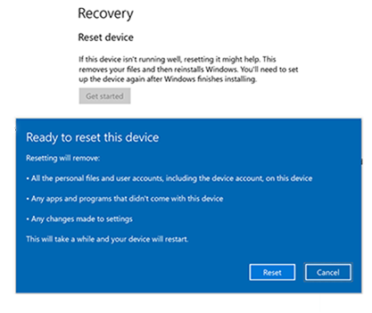

# Surface Hub 2S のリセットと回復

Surface Hub 2S で問題が発生した場合は、デバイスを工場出荷時の設定にリセットするか、USB ドライブを使用して復元できます。

まず、管理者の資格情報を使用して Surface Hub 2S にサインインし、**[設定]** アプリを開き、**[更新とセキュリティ]**、**[回復]** の順に選択します。

##  デバイスをリセットする

   > [!IMPORTANT]
   > デバイスをリセットする前に、BitLocker キーが使用できることを確認してください。後で入力するように求められます。 詳細については、「[BitLocker キーの保存](save-bitlocker-key-surface-hub.md)」を参照してください。

1. デバイスをリセットするには、**[作業の開始]** を選択します。

2. **[このデバイスをリセットする準備完了]** ウィンドウが表示されたら、**[リセット]** を選択します。 
  
   > [!IMPORTANT]
   > ハブが回復パーティションに再起動すると、BitLocker キーを入力するように求められます。 このプロンプトをスキップすると、リセットが失敗します。 BitLocker キーを入力すると、ハブは回復パーティションからオペレーティング システムを再インストールします。 完了には最大 1 時間かかる場合があります。
  
3. デバイスを再構成するには、初回セットアップ プログラムを実行します。

4. Microsoft Intune または別のモバイル デバイス管理ソリューションを使用してデバイスを管理する場合は、前のレコードをインベントリから削除してから削除し、新しいデバイスを再登録します。 詳細については、「[ワイプ、インベントリからの削除、デバイス登録の手動解除を使用し、デバイスを削除する](https://docs.microsoft.com/intune/devices-wipe)」を参照してください。

   > [!div class="mx-imgBorder"]
   > 
    *図 1. Surface Hub 2S のリセットと回復* 

##  USB 回復ドライブを使用して Surface Hub 2S を回復する

Surface Hub 2S の新機能で、回復イメージを使用してデバイスを再インストールできるようになりました。

###  USB ドライブからの回復

Surface Hub 2S を使用すると、回復イメージを使用してデバイスを再インストールできます。 これにより、BitLocker キーを紛失した場合、または設定アプリへの管理者の資格情報がなくなった場合に、デバイスを工場出荷時の設定に再インストールできます。

>[!NOTE]
>FAT32 形式でストレージが 8 GB または 16 GB の USB 3.0 ドライブを使用します。

1. 別の PC で、[Surface の回復に関する Web サイト](https://support.microsoft.com/surfacerecoveryimage?devicetype=surfacehub2s)から .zip ファイルの回復イメージをダウンロードし、これらの手順に戻ります。 

1. タスクバーの検索ボックスに **"回復ドライブ"** と入力し、結果から **[回復ドライブの作成]** または **[回復ドライブ]** を選択します。 管理者パスワードを入力するか、選択内容を確認する必要がある場合があります。

1. **[ユーザー アカウント制御]** ボックスで、**[はい]** を選択します。

1. **[システム ファイルを回復ドライブにバックアップする]** チェック ボックスをオフにして、**[次へ]** を選択します。

1. USB ドライブを選択して、**[次へ] > [作成]** の順に選択します。  複数のユーティリティを回復ドライブにコピーする必要があるため、これには数分かかる場合があります。

1. 回復ドライブの準備ができたら、**[完了]** を選択します。

1. 以前にダウンロードした回復イメージの .zip ファイルをダブルクリックして開きます。

1. 回復イメージ フォルダーからすべてのファイルを選択し、USB ドライブのルートにコピーし、**[コピー先のファイルを置き換える]** を選択します。

1. ファイルのコピーが完了したら、タスクバーの **[ハードウェアを安全に取り外してメディアを取り出す]** アイコンを選択し、USB ドライブを取り外します。

1. Surface Hub 2S の任意の USB-C ポートまたは USB-A ポートに USB ドライブを接続します。

1. ハブをオフにして、次の手順を実行して USB ドライブから起動します。

   1. [音量を下げる] ボタンを押しながら、電源ボタンを押します。
   1. Windows ロゴが表示されるまで、両方のボタンを押し続けます。
   1. 電源ボタンを離し、インストール UI が開始するまで [音量を下げる] ボタンを押し続けます。

      ![*[音量を下げる] ボタンと電源ボタンを使用して回復を開始する*](images/sh2-keypad.png)
       *図 2. 音量ボタンと電源ボタン*

1. 言語選択画面で、Surface Hub 2S の表示言語を選択します。

1. **[ドライブから回復する]**、**[ドライブを完全にクリーニングする]** の順に選択し、**[回復]** を選択します。 BitLocker キーの入力が求められたら、**[このドライブをスキップする]** を選択します。 Surface Hub 2S は数回再起動し、回復プロセス完了には約 30 分かかります。

初回セットアップ画面が表示されたら、USB ドライブを取り外します。

##  サポートに問い合わせ

ご質問がある場合や、移行を開始するためのサポートが必要な場合は、[サポート要求を作成](https://support.microsoft.com/supportforbusiness/productselection)できます。
