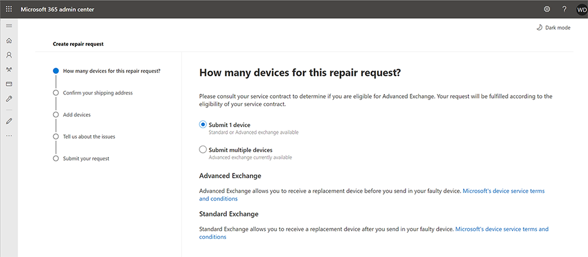

# Surface セルフサービスの保証とサービス

Microsoft 365ビジネスのお客様は、サービス注文を作成および管理するために、Microsoft 365 管理 センターの Surface セルフサービス保証とサービス ノードを使用する資格があります。 この新しい機能は、ベータ プログラムとして利用できます。グローバル管理者は、以下を含む保証およびサービスクレームのサポートを担当する会社内の個人に対するアクセス許可を指定できます。

- アップロード必要なデバイスのシリアル番号を指定します。
- 複数の配送先住所を追加します。
- 1 つ以上のデバイスと種類のカバーに対して 1 つのサービス注文を作成します。
- リアルタイムサービス注文の状態を参照してください。
- デバイスの購入の一部としてExchange延長保証または Advanced Exchange が含まれている場合は、Advance Exchange シップメントを一括で出荷および受信します。

## ベータ プログラムに参加する

エクスペリエンスとベータ プログラムへの参加方法の詳細については、Microsoft カスタマー サクセス アカウント マネージャーまたはカスタマー サクセス マネージャーにお問い合わせください。

## 役割ベースのアクセス許可

Surface Self-Serve保証とサービスを使用すると、Microsoft 365 グローバル管理者は、役割をユーザーに割り当て、サービス注文を作成および管理するためのさまざまなアクセス許可を付与できます。

ベータ プログラムMicrosoft 365テナントを追加すると、次の管理者ロールに追加のアクセス許可が付与されます。

| ロール                  | アクセス許可                                                                                                                         |
| --------------------- | ----------------------------------------------------------------------------------------------------------------------------------- |
| グローバル管理者          | 修復要求の表示 修復要求の作成および管理 アドレスへの出荷の追加/編集/削除(es) ユーザーとその役割を作成/管理する |
| サービス サポート管理者 | 修復要求の表示 修復要求の作成および管理                                                                               |
| 課金管理者         | 修復要求の表示 修復要求の作成および管理 アドレスへの出荷の追加/編集/削除(es)                                        |

ユーザーとアクセス許可の詳細については [、「Microsoft 管理センターの概要」を参照してください](/microsoft-365/admin/admin-overview/about-the-admin-center)。

## サービス注文の作成と管理

1. [センター] Microsoft 365 管理に移動 [https://admin.microsoft.com](https://go.microsoft.com/fwlink/p/?linkid=2024339) し、適切な管理者アクセス許可を使用してサインインします。 詳細については、「ビジネスで管理者[Who権限を持っているユーザー」をご覧ください。](/microsoft-365/business-video/admin-center-overview#who-has-admin-permissions-in-my-business)
2. [Surface デバイス**の**  >  **修復のサポート] に移動し、[** 修復要求の**作成] を選択します**。 (この修復オプションが表示されない場合は、このページにアクセスする権限はありません。

    > [!div class="mx-imgBorder"]
    > 

3. 1 つ以上のデバイスの修復要求を作成できます。 [一度**に 1 台のデバイスを**送信する] または [複数のデバイスを送信する] を選択して、.csv ファイルを使用して複数のシリアル番号をアップロードし、[次へ] を**選択します**。 ****

    > [!NOTE]
    > **複数のデバイスの場合:**
    >
    > - [管理センター] ページで、サンプル CSV テンプレートをダウンロードし、必要な情報を追加し、ローカル ドライブに保存します。
    > - 一**アップロード CSV ファイル**を選択し、ローカル ドライブに保存.csvファイルを選択し、[開く] を選択**します。**
    > - デバイスのシリアル番号がアップロードされます。 [次 **へ]** を選択して、修復の作成を続行します。

4. [ **出荷の置換先] で**、配送先住所を選択します。 または、[新  **しいアドレスの追加] を選択します**。

    > [!NOTE]
    >
    > - アクセス許可を使用すると、特定の管理者が住所に新しい出荷を追加できます。 アクセス許可がある場合は、>アドレスを追加できます。 必要な情報を入力し、[保存] を  **選択します**。
    > - フォームは住所情報を自動的に検証し、住所がローカルの郵便システムによって認識されない場合は、変更を加える修正を受け取る場合があります。 電子メール アドレスは、修復要求の通知と通信を送信するために使用されます。

    > [!div class="mx-imgBorder"]
    > 

5. テキスト ブロックにデバイスのシリアル番号を入力してデバイスを追加します。 詳細については、「デバイスのシリアル [番号」を参照してください](https://support.microsoft.com/help/4036293/surface-find-the-serial-number-on-surface)。 シリアル番号が有効な場合は、保証日とモデル番号を含む画像と製品情報が表示されます。 情報が **正しい場合は、[デバイスの** 追加] を選択します。

    > [!div class="mx-imgBorder"]
    > 

6. 手順 1 ~ 2 を繰り返して、要求に複数のデバイス (合計 20 台まで) を追加します。
7. ドロップダウン メニューから、問題を最も適切に説明する問題の種類を選択し、[次へ] を選択 **します。**

    > [!div class="mx-imgBorder"]
    > 

8. 注文を確認します。 情報が正しくない場合は、[戻る] **を選択して** エラーを修正します。
9. 条件に同意します。
10. 要求の概要が正しい場合は、[要求の送信 **] を選択します**。

    > [!div class="mx-imgBorder"]
    > 

ホーム ページが表示された場合は、サービス要求を概要リストに表示し、確認メールを受信できます。

## よく寄せられる質問

### エラー コード 400 "汎用クライアント サービス エラー"、401 "承認されていないサービス エラー" またはエラー 403 "Forbidden service error"が表示される理由

ユーザー アカウントに問題がMicrosoft 365、またはユーザーがコンテンツにアクセスするためのアクセス許可を持ってない可能性があります。 グローバル管理者に連絡Microsoft 365サポートを受けてください。

### 配送先住所を入力し、配送料の提供がないというエラー メッセージが表示される場合

Surface サービスSelf-Serveサービス ベータ版では、現時点での可用性が制限されています。 オファーは、住所が次のいずれかの国にある場合にのみ利用できます。

オーストリア、バーレーン、ベルギー、ブルガリア、クロアチア、キプロス、チェコ共和国、デンマーク、エストニア、フィンランド、フランス、ドイツ、ギリシャ、ハンガリー、アイルランド、イタリア、クウェート、ラトビア、リトアニア、ルクセンブルク、マルタ、オランダ、オマーン、ポーランド、ポルトガル、ルーマニア、スロバキア、スロベニア、南アフリカ、スペイン、スウェーデン、英国 (北アイルランドを除く)。

### ポータルで注文した注文はどこでMicrosoft 365できますか?

[Microsoft 365 管理センター [- サービス要求] に移動](https://admin.microsoft.com/Adminportal/Home?source=applauncher#/support/devicerepairs)し、資格情報を使用Microsoft 365します。

Microsoft カスタマー サポートを通じて作成された注文は、[保証とサービス管理] Self-Serveには表示されません。

### 配送先住所を追加、編集、または削除できない理由

配送先住所を追加、編集、または削除する機能は、Microsoft 365 グローバル管理者または請求管理者が行う必要があります。連絡を取って支援を受けてください。  

### Surface サービスの保証とサービスベータ版の Microsoft サポートSelf-Serve問い合わせ方法

Microsoft 管理センターの Surface サポート モジュールから直接サポートに問い合わせできます。

1. 資格情報を使用して Microsoft 管理センターにサインインMicrosoft 365します。
2. [Surface ****  >  **Device Repairs のサポート] >ヘルプが必要ですか?** を選択し、問題について説明します。
3. 結果が解決しない場合は、[サポート **に問い合**わせ] を選択し、問題の説明を入力します。 連絡先番号とメール アドレスを確認し、希望する連絡先の方法を選択し、[お問い合わせ] **を選択します**。
